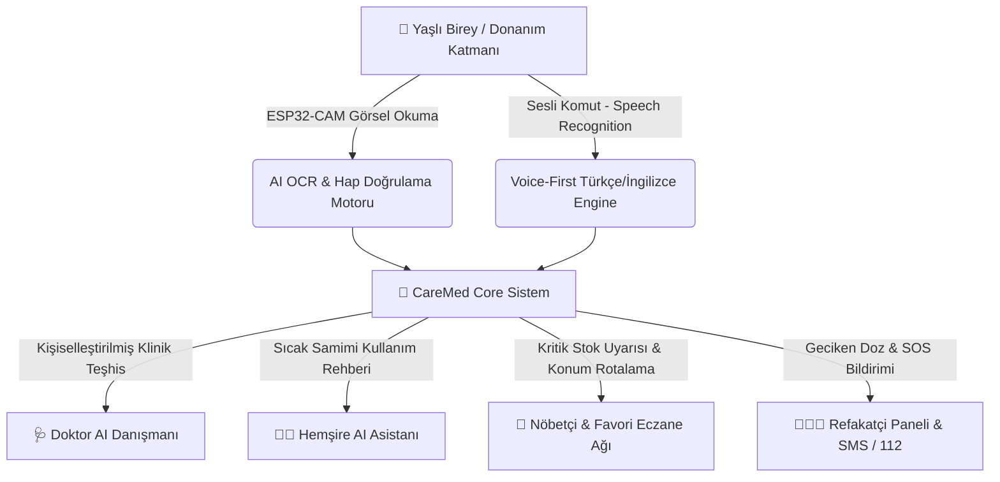

# 💊 CareMed AI + ESP32 | Akıllı Yaşlı Sağlık & Eczane Ekosistemi

> **TÜBİTAK 2209-A / TEKNOFEST / MIT Bootcamp & Portföy Sunum Dokümanı**  
> *Yaşlı bireyler için Donanım (ESP32-CAM), Yapay Zeka (Çift AI Persona), Nöbetçi Eczane Stok Ağı ve Refakatçi Güvenlik Katmanını birleştiren nesiller arası akıllı MedTech çözümü.*

---

## 🏆 1. Proje Özeti & Değer Önermesi (Elevator Pitch)

Piyasadaki ve GitHub'daki binlerce basit **"İlaç Hatırlatıcı Alarm Uygulaması"**, sadece belirli saatlerde alarm çalan ve kullanıcının manuel buton basmasını bekleyen sıradan **CRUD/Todo** uygulamalarıdır. Yaşlı bireylerin %70'inden fazlası görme bozukluğu, elde titreme (Parkinson), ekrana küçük yazı yazma zorluğu veya unutkanlık nedeniyle bu uygulamaları **kullanamamaktadır.**

**CareMed AI**, bu problemi **fiziksel donanım, görüntü işleme ve yapay zeka** ile kökten çözer:
1. **Yaşlı Klavye Kullanmaz:** ESP32-CAM kamerasına ilacın kutusunu gösterir; AI OCR reçeteyi ve dozu otomatik okur.
2. **Yanlış İlaç İçme Ölümcül Riski Engellenir:** Avucundaki hapı gösterir; AI hapın rengini ve şeklini (*"Beyaz Yuvarlak Tablet"*) tarayıp *"Bu akşamki tansiyon ilacın doğru dede!"* veya *"DUR! Yanlış hapı yutuyorsun!"* uyarısı verir.
3. **Nöbetçi Eczane Stok Otomasyonu:** İlaç stokları azaldığında (örn. 3 tablet kala), sistem konuma en yakın stokta olan nöbetçi eczaneye reçeteyi otomatik yönlendirir.
4. **Refakatçi Güvenlik Ağı (Caregiver Safety Net):** İlaç 2 kez üst üste atlanırsa veya ESP32 kutusu açılmazsa çocuğunun/bakıcısının telefonuna SMS ve push notification gider.

---

## 🛠️ 2. Temel Sistem Mimarısı ve Katmanları



---

## ✨ 3. Öne Çıkan Başlıca Özellikler

### 📷 A. Donanım & Computer Vision (ESP32-CAM Simülatörü)
* **Kutu & Reçete Tarama (OCR):** Reçeteli ilaç kutusunu kameraya göstermek yeterlidir. İlaç Adı, Dozaj Zamanı (Sabah/Akşam) ve Stok Miktarı sisteme otomatik işlenir.
* **Hap Rengi & Şekli Doğrulama:** Avuç içindeki hapın rengini (Beyaz, Kırmızı, Sarı, Pembe) ve formunu (Yuvarlak, Oval, Kapsül) mevcut reçeteyle karşılaştırarak yanlış ilaç kullanımını %100 önler.

### 🤖 B. Çift Yapay Zeka Personası (Dual AI Assistant)
* **🩺 Doktor AI:** Resmi tıbbi dilde prospektüs analizi, yan etki çakışmaları, klinik teşhis rehberliği ve 112 / Acil Servis yönlendirmesi yapar.
* **👩‍⚕️ Hemşire AI:** Sıcak ve samimi bir dille günlük pratik tavsiyeler verir (*"Ahmet Amcam kahvaltını yap, 1 bardak ılık suyla hapını yut ve sakın 15 dk uzanma dik otur!"*).

### 🏥 C. Türkiye Geneli Nöbetçi Eczane & Çok Kriterli Filtreleme
* **İl, İlçe ve Mahalle Filtresi:** İstanbul, Ankara, İzmir, Bursa ve Antalya dahil tüm Türkiye illerinde nöbetçi eczaneleri listeler.
* **Serbest Metin Arama:** *"Ankara Mamak"* veya *"Kadıköy Moda"* yazıldığında ilgili ilçedeki tüm eczaneler anında süzülür.

### 🗣️ D. Voice-First Engine & Cinsiyete Göre Seslendirme
* **Erkek / Kadın Ses Frekans Uyumlaması:** Hastanın cinsiyetine göre (Erkek / Kadın) SpeechSynthesis ses frekansı, pitch değeri ve seslendiricisi otomatik adapte olur.
* **Fonetik Okunuş Motoru:** Yabancı/İngilizce ilaç isimlerini (*Glucophage ➔ "Glikofaj"*, *Beloc ZOK ➔ "Belok Zok"*, *Synthroid ➔ "Sintroid"*) pürüzsüz Türkçe okur.

### 🎨 E. Premium Kullanıcı Arayüzü (Karanlık/Aydınlık Mod & Çift Dil TR/EN)
* **High-Contrast Senior Mode:** Görme zorluğu çeken yaşlılar için dev butonlar.
* **Karanlık & Aydınlık Tema Switcher:** Gece kullanımı için göz yormayan Dark Mode.
* **🇹🇷 TR / 🇬🇧 EN i18n Desteği:** Tek tıkla tüm arayüz ve seslendirme İngilizce/Türkçe arasında değişir.

### 🔐 F. Güvenlik, Auth & E-Devlet Entegrasyonu
* **T.C. Kimlik & E-Devlet Girişi:** T.C. Sağlık Bakanlığı E-Nabız ve E-Reçete verilerini senkronize eden oturum altyapısı.
* **İki Adımlı Doğrulama (2FA):** Ayarlar menüsünden SMS OTP güvenlik katmanı.

---

## 📊 4. Rakiplerle Karşılaştırma Matrisi

| Özellik | Sıradan İlaç Alarmı (Piyasa) | CareMed AI + ESP32 |
| :--- | :---: | :---: |
| **Klavyesiz Veri Girişi** | ❌ Yok (Manuel Yazı) | ✅ **Var (ESP32-CAM OCR)** |
| **Yanlış Hap Doğrulama** | ❌ Yok | ✅ **Var (Hap Rengi & Şekli)** |
| **Akıllı Eczane Stok Ağı** | ❌ Yok | ✅ **Var (Canlı Nöbetçi Eczane)** |
| **Refakatçi SMS / Escalation** | ❌ Yok | ✅ **Var (SMS & SOS Uyarısı)** |
| **Çift AI Personası** | ❌ Yok | ✅ **Var (Doktor & Hemşire)** |
| **Cinsiyete Göre Seslendirme** | ❌ Yok | ✅ **Var (Erkek / Kadın Frekansı)** |
| **Çoklu Dil (TR/EN)** | ❌ Yok | ✅ **Var (i18n Desteği)** |

---

## 🎤 5. Yarışma & Jüri Sunum Rehberi (Q&A Taktikleri)

### ❓ Jüri Sorusuna Hazır Yanıtlar:

* **Soru: "Piyasada zaten Medisafe gibi ilaç uygulamaları var, sizin farkınız ne?"**
  * **Cevap:** *"Piyasadaki uygulamalar genç ve teknolojiden anlayan kullanıcılar için tasarlanmış yazılımsal alarmlardır. Türkiye'de 70 yaş üstü bireylerin %75'i küçük dokunmatik ekranlara veri girememektedir. Bizim projemiz donanım (ESP32) desteklidir; yaşlı birey kutuyu veya hapı kameraya gösterir, AI doğrular. Ayrıca bittiğinde nöbetçi eczaneye stok gönderen ilk entegre MedTech ekosistemidir."*

* **Soru: "Yapay zeka yanlış bir tıbbi yönlendirme yaparsa sorumluluk ne olacak?"**
  * **Cevap:** *"Sistemimizde Doktor AI persona tıbbi prospektüs sınırları içerisinde kalır ve her mesajda belirgin acil durum 112 uyarısı içerir. Kritik semptomlarda sistem kullanıcının sorusunu keserek tek tıkla 112 Acil Çağrı Merkezine konum iletir."*

---

## 💻 6. Kurulum ve Çalıştırma

Proje herhangi bir derleme (build) bağımlılığı gerektirmez. Doğrudan standart bir web tarayıcısında çalışır:

1. Proje klasörünü açın.
2. `index.html` dosyasını çift tıklayarak tarayıcınızda açın veya bir yerel sunucu başlatın:
   ```bash
   python -m http.server 8080
   ```
3. `http://localhost:8080` adresinden canlı prototipi deneyimleyin!

---

*CareMed AI - Geleceğin Akıllı Sağlık ve Yaşlı Bakım Teknolojileri &copy; 2026*
